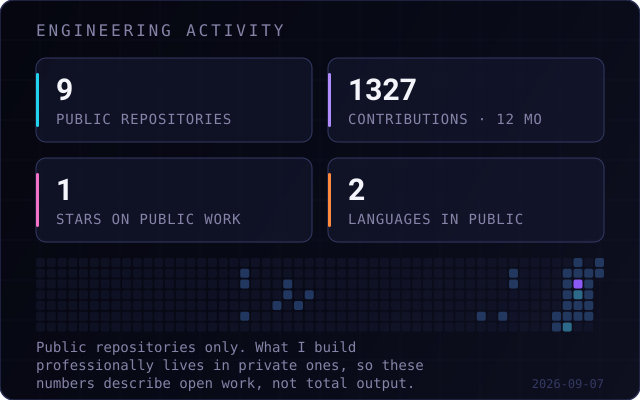

  

  <a href="https://francescoiaforte.vercel.app"><b>Portfolio</b></a> ·
  <a href="https://www.linkedin.com/in/francesco-iaforte-818b96198">LinkedIn</a> ·
  <a href="https://francescoiaforte.vercel.app/cv/Francesco-Iaforte-CV.pdf">CV</a> ·
  <a href="mailto:francescoiaforte@gmail.com">Email</a>

---

I build software systems that go into production and stay there.

Over the last years I have shipped management platforms, multi-company SaaS, AI agents and
document-intelligence pipelines end to end — architecture, data model, backend, frontend,
integrations, security and deployment. My background is management engineering, so I read the
business process before I write the code, and the systems below are shaped by that.

Currently AI Engineer & Full-Stack Developer at **InnovEdge**, Naples.

---

## Selected systems

Six systems, each with its own engineering case study. The source code stays private —
these repositories document the architecture, the decisions and the product work.

| System | What it is | Stack | Role |
|---|---|---|---|
| **[OptiBuild](https://github.com/francescoveryra-dot/optibuild-showcase)** | Construction-site platform that turns 500+ page quantity surveys into structured, costed work | Laravel · React · Capacitor · Python · MySQL | Architecture, data layer, AI parsing, modules |
| **[AI Retail Operations](https://github.com/francescoveryra-dot/ai-retail-operations-showcase)** | Food, retail and logistics platform with an AI assistant that performs real operations | React · TypeScript · Supabase · PostgreSQL · Capacitor | Modules, logistics, AI and forecasting layer |
| **[TemaSuite](https://github.com/francescoveryra-dot/temasuite-showcase)** | Multi-company hospitality SaaS: bookings, Channel Manager, OTA sync, full accounting cycle | Laravel · Angular · PrimeNG · Stripe · MySQL | Full-stack architecture, API, data model, workflows |
| **[Miele+](https://github.com/francescoveryra-dot/miele-plus-showcase)** | B2B sales platform whose AI agent answers on real data and cites its sources | NestJS · Prisma · React · TanStack Query | Backend modules, AI components, integrations |
| **[IAF Agent OS](https://github.com/francescoveryra-dot/iaf-agent-os-showcase)** | Control plane that makes AI-assisted development governable across four different IDEs | Agents · skills · policies · deterministic gates | Designed and built independently |
| **[Athleta](https://github.com/francescoveryra-dot/athleta-showcase)** | Personal AI fitness product where every user owns a queryable knowledge graph | React 19 · Supabase · PostgreSQL · RAG · LLM Wiki | Everything, end to end |

Each case study links back to the interactive version on the
[portfolio](https://francescoiaforte.vercel.app), where you can walk the real interfaces.

---

## Systems I build

I own the whole column, not one band of it. That is the reason a feature can start as a
business conversation and end as a deployed, monitored, access-controlled module.

---

## Engineering domains

**AI & machine learning**  
RAG pipelines · LLM Wiki · AI agents · multi-agent orchestration · embeddings (BGE-M3, Gemini) ·
vector databases · hybrid retrieval · LoRA / QLoRA fine-tuning · PyTorch · Hugging Face ·
ML forecasting · predictive analytics · prompt and context engineering

**Backend & APIs**  
Laravel · NestJS · Node.js · Python · PHP · Java · Spring Boot · C++ · REST · webhooks ·
queues and workers · background jobs

**Frontend & mobile**  
React · Next.js · Angular · TypeScript · React Native · Flutter · Capacitor · Tailwind · PrimeNG

**Data**  
PostgreSQL · MySQL · MariaDB · Supabase · MongoDB · SQLite · Prisma · Eloquent

**Infrastructure & delivery**  
Linux · SSH · WHM/cPanel · Docker · Kubernetes · Git · Jenkins · OpenShift ·
multi-environment deploy · SSL · cron · backups · server migrations

**Security & practices**  
Role-based access control · row-level security · audit trails · secrets handling ·
environment separation · automated testing · code review · technical documentation

AI-assisted development is part of the workflow, not a substitute for it:
Claude Code, Cursor, Codex and Antigravity, governed by the control plane in
<a href="https://github.com/francescoveryra-dot/iaf-agent-os-showcase">IAF Agent OS</a>.

---

## Engineering activity

This card counts <b>public repositories only</b>, and it says so on its face. The platforms
above are private client and product repositories, so no public metric can represent the real
volume of the work. The contribution calendar directly below on this profile is the honest
place to look.

---

## Certifications

| Certification | Issuer | Verify |
|---|---|---|
| Claude with Amazon Bedrock | Anthropic Education | [verify](https://verify.skilljar.com/c/ta8s5w89qip2) |
| Claude with Google Cloud Vertex AI | Anthropic Education | [verify](https://verify.skilljar.com/c/d393tp8iee3w) |
| Building with the Claude API | Anthropic Education | [verify](https://verify.skilljar.com/c/2ckhzh6zn7oa) |
| Claude Code in Action | Anthropic Education | [verify](https://verify.skilljar.com/c/rabn3wrf46er) |
| Automation & Workflow · API Integrations · AI Workflows | n8n | — |

Management engineering (logistics and production), University of Naples Federico II.

---

  <a href="https://francescoiaforte.vercel.app"><b>francescoiaforte.vercel.app</b></a> 
  Naples, Italy — open to AI engineering, full-stack and architecture work.

